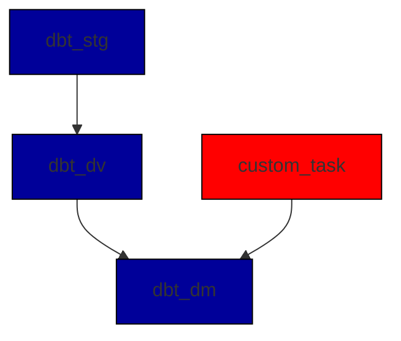

# DynamicDBT-PrefectFlowGenerator

## Overview
This project aims to dynamically create Prefect flows for managing DBT models. It auto-generates Python code for Prefect flows based on the dependencies between DBT models. The generated Prefect flows can be further customized to include additional tasks.
You can make it more complex by utilizing dbt tags. And run this flow for specified tag only.




Requirements
Python 3.x
Prefect
DBT
Bash (for script execution)

## Installation
Clone this repository and install the necessary Python packages:

```
git clone https://gitlab.com/PavelLambo/DynamicDBT-PrefectFlowGenerator.git
cd DynamicDBT-PrefectFlowGenerator
```

## Customization
You can customize the generated Prefect flow by modifying the code template in generate_dynamic_flow function.

## Contributing
Feel free to open issues or PRs if you have improvements or fixes.

## License
This project is licensed under the MIT License - see the LICENSE.md file for details.
